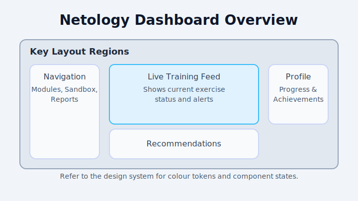

# Netology-FYP

Netology is a prototype security training platform that combines a FastAPI backend, a static frontend, and supporting infrastructure for local development and deployment experiments.

## 📚 Table of contents
- [Architecture overview](#-architecture-overview)
- [Prerequisites](#-prerequisites)
- [Setup](#-setup)
  - [Local development](#local-development)
  - [Docker](#docker)
  - [AWS](#aws)
- [Deployment steps](#-deployment-steps)
- [Diagrams and UI references](#-diagrams-and-ui-references)
- [Troubleshooting](#-troubleshooting)
- [Project structure](#-project-structure)
- [Design principles](#-design-principles)
- [Notes](#-notes)

## 🏗️ Architecture overview
Netology follows a modular architecture split across the backend API, a Vite-enabled static frontend, and optional infrastructure assets for containerisation and infrastructure-as-code experiments.

```mermaid
flowchart LR
    subgraph Client
        UI[Responsive UI\nVite/Vanilla JS]
    end
    subgraph API
        API[FastAPI service]
        Auth[JWT Auth]
        Sim[Simulation engine]
    end
    subgraph Data
        DB[(PostgreSQL)]
        Seeds[(Seed Data)]
    end
    subgraph Observability
        Logs[(Structured logs)]
    end

    UI -->|REST| API
    API -->|SQLAlchemy| DB
    API --> Logs
    Seeds --> DB
    Sim --> API
```

Key characteristics:
- **Backend** — FastAPI application with modular routers, SQLAlchemy models, and Pydantic schemas.
- **Frontend** — Vite-powered static site with dedicated views for onboarding, dashboards, and a sandbox.
- **Data layer** — PostgreSQL schema defined in `infra/database`, with optional seed data for demo content.
- **Deployment targets** — Docker Compose for local parity and AWS (ECS + RDS) for managed hosting.

## ✅ Prerequisites
Install or provision the following before you start:
- Python 3.10+
- Node.js 18+ (required for the Vite toolchain)
- Docker and Docker Compose (optional but recommended for parity)
- PostgreSQL 13+ instance (local container or managed service)
- AWS CLI v2 configured with credentials (for AWS deployment flows)

## ⚙️ Setup

### Local development
1. **Environment variables**
   - Duplicate `backend/.env.example` (or create `.env`) and provide database credentials.
   - Create a repository-level `.env` file if you need to override the frontend `VITE_API_BASE`.
2. **Backend API**
   ```bash
   python -m venv .venv
   source .venv/bin/activate
   pip install -r backend/requirements.txt
   uvicorn backend.main:app --reload
   ```
3. **Database schema**
   ```bash
   createdb netology_fyp  # or use docker-compose PostgreSQL service
   python -m backend.migrate
   psql netology_fyp < infra/database/seed.sql  # optional demo data
   ```
4. **Frontend**
   ```bash
   npm install
   npm run dev  # serves on http://localhost:5173/login.html
   ```

### Docker
A ready-to-use compose stack lives in `infra/docker/docker-compose.yml`.

```bash
cd infra/docker
cp ../../backend/.env.example ../../backend/.env  # update with secrets
cp ../../infra/database/seed.sql ./seed.sql       # optional volume mount
docker compose up --build
```

The compose file builds the backend and frontend images from `Dockerfile.backend` and `Dockerfile.frontend`, provisions PostgreSQL, and wires the services together through an internal network.

### AWS
Deploying to AWS assumes you are targeting ECS Fargate for the application tier and RDS PostgreSQL for the database.

1. **Bootstrap infrastructure**
   - Provision an RDS PostgreSQL instance and store credentials in AWS Secrets Manager.
   - Create an S3 bucket for asset hosting if you serve the frontend statically via CloudFront.
   - Ensure a VPC with public subnets (for load balancers) and private subnets (for ECS tasks).
2. **Container registry**
   ```bash
   aws ecr create-repository --repository-name netology/backend
   aws ecr create-repository --repository-name netology/frontend
   aws ecr get-login-password | docker login --username AWS --password-stdin <aws_account_id>.dkr.ecr.<region>.amazonaws.com
   docker build -f Dockerfile.backend -t netology-backend .
   docker build -f Dockerfile.frontend -t netology-frontend .
   docker tag netology-backend:latest <aws_account_id>.dkr.ecr.<region>.amazonaws.com/netology/backend:latest
   docker tag netology-frontend:latest <aws_account_id>.dkr.ecr.<region>.amazonaws.com/netology/frontend:latest
   docker push <aws_account_id>.dkr.ecr.<region>.amazonaws.com/netology/backend:latest
   docker push <aws_account_id>.dkr.ecr.<region>.amazonaws.com/netology/frontend:latest
   ```
3. **Service deployment**
   - Create ECS task definitions referencing the pushed images and inject environment variables from Secrets Manager.
   - Configure an Application Load Balancer routing to the backend service.
   - Serve the frontend via CloudFront (backed by S3) or as another ECS service behind the same ALB.
4. **Database migrations**
   - Run `python -m backend.migrate` from a one-off ECS task or AWS Systems Manager Session Manager targeting the backend container.

## 🚀 Deployment steps
Regardless of the hosting environment, release builds follow the same pattern:
1. **Run automated checks** (unit tests, linting, Vite build) locally or in CI.
2. **Build artefacts**
   - `npm run build` outputs static assets under `frontend/dist`.
   - `docker build` (backend/frontend) creates container images for deployment.
3. **Apply migrations** using `python -m backend.migrate` against the target PostgreSQL instance.
4. **Update environment configuration** with any new secrets or feature flags.
5. **Publish artefacts** to the relevant registry or hosting platform (ECR/S3).
6. **Smoke test** using the sandbox module and dashboard views to verify connectivity.

## 🖼️ Diagrams and UI references
- **Architecture flow** — see the Mermaid diagram in [Architecture overview](#-architecture-overview).
- **User journey**

  ```mermaid
  sequenceDiagram
      participant U as User
      participant FE as Frontend (Vite)
      participant BE as Backend (FastAPI)
      participant DB as PostgreSQL

      U->>FE: Open login page
      FE->>BE: POST /auth/login
      BE->>DB: Validate credentials
      DB-->>BE: Auth success
      BE-->>FE: JWT token
      FE->>BE: GET /dashboard data
      BE->>DB: Fetch modules & sandbox state
      DB-->>BE: Data payload
      BE-->>FE: JSON response
      FE-->>U: Render dashboard widgets
  ```

- **Dashboard layout overview** — 

## 🛠️ Troubleshooting
| Issue | Symptoms | Resolution |
|-------|----------|------------|
| Database connection failures | `psycopg2.OperationalError` or FastAPI startup timeout | Confirm credentials in `backend/.env`, ensure the PostgreSQL service is reachable (check `docker compose ps`), and verify SSL requirements for managed databases. |
| Docker build errors | Build stops with missing dependencies | Clear stale build cache (`docker builder prune`), ensure the base images specified in `Dockerfile.backend`/`Dockerfile.frontend` are accessible, and confirm proxy settings if building behind a firewall. |
| Frontend cannot reach API | Console shows CORS errors or `net::ERR_CONNECTION_REFUSED` | Set the correct `VITE_API_BASE` in `.env`, enable CORS in `backend/main.py`, and ensure ports 8000 (backend) and 5173 (frontend) are exposed. |
| AWS deployment fails health checks | ALB reports `5XX` or unhealthy targets | Verify security groups, confirm ECS task definitions reference the right container port, and check CloudWatch logs for stack traces. |

## 📁 Project structure
```
Netology-FYP/
├── backend/                    # FastAPI application and supporting modules
│   ├── main.py                 # Application entry point
│   ├── auth.py                 # Authentication helpers
│   ├── db.py                   # PostgreSQL connection utilities
│   ├── models.py               # SQLAlchemy models
│   ├── schemas.py              # Pydantic schemas
│   ├── routes/                 # API route definitions
│   └── simulation/             # Network simulation prototype code
├── frontend/                   # Static HTML/CSS/JS client
│   ├── login.html              # Authentication screens
│   ├── signup.html             # Registration page
│   ├── dashboard.html          # Authenticated dashboard
│   ├── sandbox.html            # Network sandbox interface
│   ├── css/                    # Stylesheets
│   └── js/                     # Client-side behaviour
└── infra/                      # Database schema and container configuration
    ├── database/               # SQL assets for PostgreSQL
    │   ├── schema.sql          # Database schema definition
    │   └── seed.sql            # Sample seed data
    └── docker/                 # Docker build + compose assets
        ├── Dockerfile-backend  # Backend container definition
        ├── Dockerfile-frontend # Frontend container definition
        └── docker-compose.yml  # Local development stack
```

## 🧭 Design principles
- **Nielsen's heuristics** inform system feedback, undo pathways, and consistent language across views.
- **Hick's and Miller's laws** guided the number of visible actions per page and chunked information blocks.
- **Accessibility research** (WCAG 2.2, British Dyslexia Association) shaped colour contrast, typography, and theme toggles.

## 📝 Notes
- The legacy `C22320301-Netology/` project layout has been consolidated into the top-level folders described above for easier navigation.
- Update paths in any local scripts or deployment pipelines to reference `backend/`, `frontend/`, and `infra/` directly.
